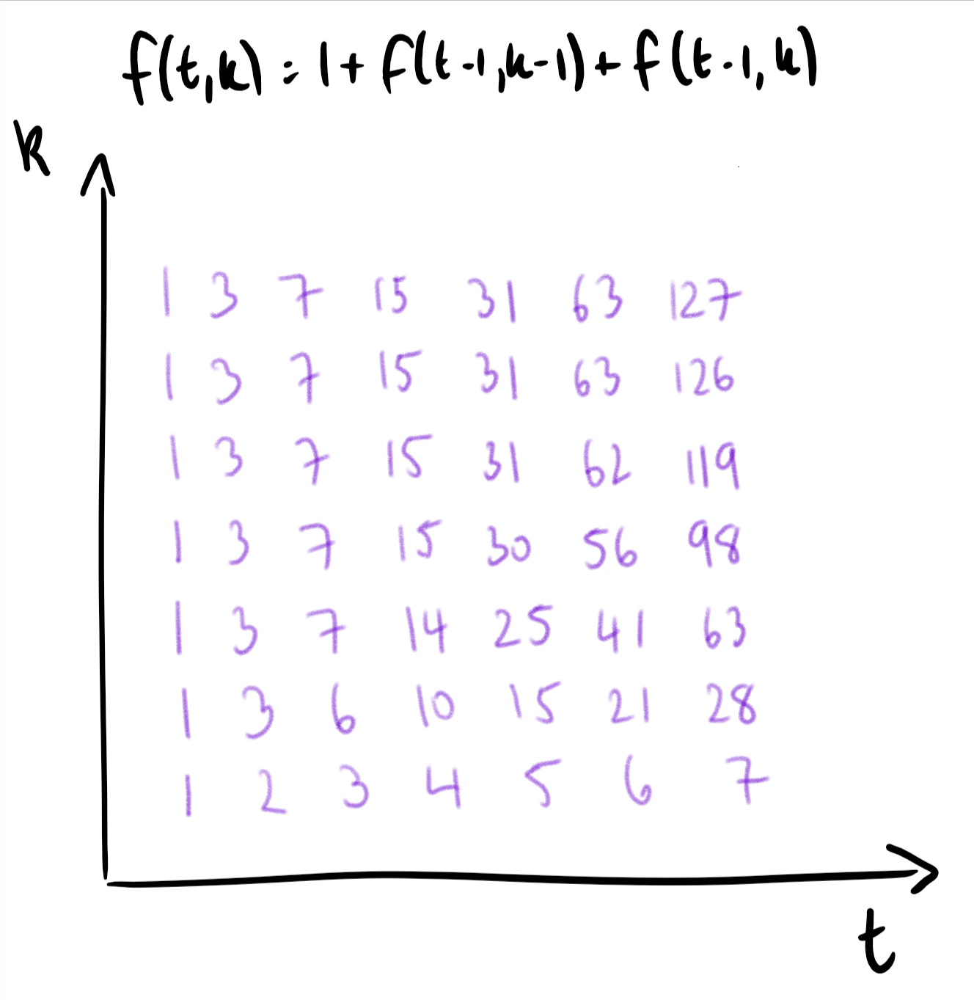

## [887.Super Egg Drop](https://leetcode.com/problems/super-egg-drop/description/)

You are given `K` eggs, and you have access to a building with `N` floors from `1` to `N`. 

Each egg is identical in function, and if an egg breaks, you cannot drop it again.

You know that there exists a floor `F` with `0 <= F <= N` such that any egg dropped at a floor higher than `F` will break, and any egg dropped at or below floor `F` will not break.

Each *move*, you may take an egg (if you have an unbroken one) and drop it from any floor `X` (with `1 <= X <= N`). 

Your goal is to know **with certainty** what the value of `F` is.

What is the minimum number of moves that you need to know with certainty what `F` is, regardless of the initial value of `F`?

 


**Example 1:**

```
Input: K = 1, N = 2
Output: 2
Explanation: 
Drop the egg from floor 1.  If it breaks, we know with certainty that F = 0.
Otherwise, drop the egg from floor 2.  If it breaks, we know with certainty that F = 1.
If it didn't break, then we know with certainty F = 2.
Hence, we needed 2 moves in the worst case to know what F is with certainty.
```

**Example 2:**

```
Input: K = 2, N = 6
Output: 3
```

**Example 3:**

```
Input: K = 3, N = 14
Output: 4
```

 

**Note:**

1. `1 <= K <= 100`
2. `1 <= N <= 10000`

## [Solution](./s.c)

#### Approach 3: Mathematical

**Intuition**

Let's ask the question in reverse: given **T** moves (and KK eggs), what is the most number of floors **f(T,K)**that we can still "solve" (find 
$$
0 \leq F \leq f(T, K)0≤F≤f(T,K)
$$
 with certainty)? Then, the problem is to find the least **T** for which 
$$
f(T, K) \geq N
$$
. Because more tries is always at least as good, **f** is increasing on **T**, which means we could binary search for the answer.

Now, we find a similar recurrence for ff as in the other approaches. If in an optimal strategy we drop the egg from floor 
$$
X_{\emptyset}
$$
, then either it breaks and we can solve **f(T-1, K-1)** lower floors (floors <X∅); or it doesn't break and we can solve **f(T-1, K)** higher floors (floors ≥X∅). In total,
$$
f(T, K) = 1 + f(T-1, K-1) + f(T-1, K)f(T,K)=1+f(T−1,K−1)+f(T−1,K)
$$
Also, it is easily seen that
$$
f(t, 1) = t
$$
 when
$$
t \geq 1
$$
, and **f(1, k) = 1** when 
$$
k \geq 1
$$
.



From here, we don't need to solve the recurrence mathematically - we could simply use it to generate all 
$$
O(K * \max(T))O(K∗max(T))
$$
 possible values of 
$$
f(T, K)f(T,K)
$$
.

However, there is a mathematical solution to this recurrence. If
$$
g(t, k) = f(t, k) - f(t, k-1)g(t,k)=f(t,k)−f(t,k−1)
$$
, [the difference between the **k-1**th and **k**th term,] then subtracting the two equations:
$$
f(T, K) = 1 + f(T-1, K-1) + f(T-1, K)f(T,K)=1+f(T−1,K−1)+f(T−1,K)
$$

$$
f(T, K-1) = 1 + f(T-1, K-2) + f(T-1, K-1)f(T,K−1)=1+f(T−1,K−2)+f(T−1,K−1)
$$
we get:
$$
g(t, k) = g(t-1, k) + g(t-1, k-1)g(t,k)=g(t−1,k)+g(t−1,k−1)
$$
This is a binomial recurrence with solution 
$$
g(t, k) = \binom{t}{k+1}g(t,k)=(k+1t)
$$
, so that indeed,
$$
f(t, k) = \sum\limits_{1 \leq x \leq K} g(t, x) = \sum \binom{t}{x}f(t,k)=1≤x≤K∑g(t,x)=∑(xt)
$$

**Alternative Mathematical Derivation**

Alternatively, when we have tt tries and **K** eggs, the result of our tt throws must be a tt-length sequence of successful and failed throws, with at most **K** failed throws. The number of sequences with **0** failed throws is
$$
\binom{t}{0}
$$

, the number of sequences with **1** failed throw is
$$
 \binom{t}{1}
$$
 etc., so that the number of such sequences is 
$$
\sum\limits_{0 \leq x \leq K} \binom{t}{x}0≤x≤K∑(xt)
$$
.

Hence, we can only distinguish at most these many floors in tt tries (as each sequence can only map to 1 answer per sequence.) This process includes distinguishing **F = 0**, so that the corresponding value of **N** is one less than this sum.

However, this is also a lower bound for the number of floors that can be distinguished, as the result of a throw on floor **X** will bound the answer to be either at most **X** or greater than **X**. Hence, in an optimal throwing strategy, each such sequence actually maps to a unique answer.

**Algorithm**

Recapping our algorithm, we have the increasing [wrt tt] function , and we want the least ttso that 
$$
f(t, K) \geq Nf(t,K)≥N
$$
. We binary search for the correct tt.

To evaluate **f(t, K)** quickly, we can transform the previous binomial coefficient to the next (in the summand) by the formula 
$$
\binom{n}{k} * \frac{n-k}{k+1} = \binom{n}{k+1}(kn)∗k+1n−k=(k+1n)
$$
.